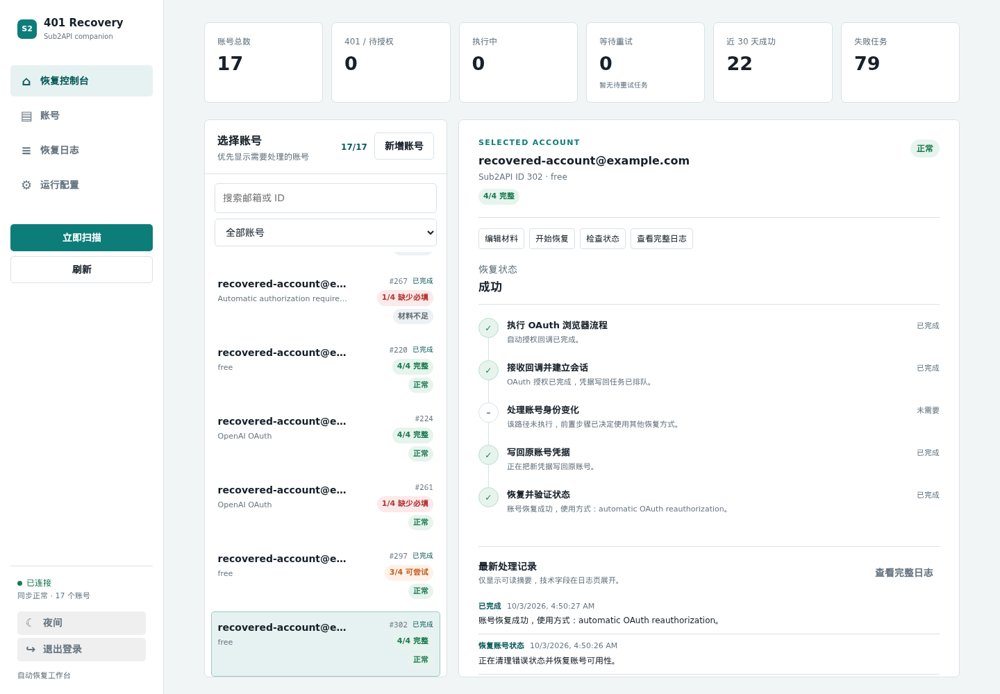

# Sub2API 401 Recovery

中文文档：[README.zh-CN.md](README.zh-CN.md)

> A self-hosted Sub2API companion for detecting OpenAI OAuth 401s and recovering eligible accounts through a real OAuth browser flow.

Sub2API 401 Recovery is a companion service for Sub2API. It watches OpenAI OAuth accounts, detects invalid authentication, performs automatic OAuth reauthorization when the required login materials are available, and writes the new credentials back to the original Sub2API account.

It is designed for operators who manage their own Sub2API instance and need a durable recovery queue, clear failure stages, and an audit trail instead of manually repairing accounts one by one.


The screenshot below is a sanitized view of a real successful recovery task. It shows the browser OAuth flow, callback session, credential write-back, and final account-state verification.



## What It Does

- Synchronizes OpenAI OAuth and `setup-token` accounts through the Sub2API Admin API.
- Reads persisted account errors such as HTTP 401, `token_revoked`, `invalid_token`, and `invalid_grant`.
- Performs a low-frequency upstream probe using a model discovered from each account's current `/models` catalog. Model names are not hard-coded.
- Starts a real Chromium OAuth flow for confirmed authentication failures.
- Retrieves mailbox verification codes through IMAP or the optional Outlook Webmail fallback.
- Generates TOTP codes locally when a TOTP secret is available.
- Completes PKCE authorization-code exchange and applies the new credentials to the original Sub2API account.
- Verifies the recovered account and restores schedulability.
- Shows each recovery stage, retry state, technical error, and account-specific history in the Dashboard.
- Provides an independent mailbox pool for reusable email credentials. Passwords are encrypted at rest, masked in the list, and retained after a Sub2API account is deleted.
- Captures encrypted screenshots when OpenAI displays an account-deleted or account-disabled page.
- Provides guarded manual deletion for accounts that have been independently confirmed as disabled.

The service does not modify Sub2API source code and does not silently create replacement accounts. A changed OAuth identity is reported explicitly and handled according to the configured recovery policy.

## How Detection Works

There are two separate checks:

1. **State synchronization:** every 60 seconds, the worker reads Sub2API account state and details. This is an Admin API read and does not send an OpenAI model request.
2. **Active upstream probe:** at most one eligible account per scan is tested using Sub2API's SSE account-test endpoint. The model is selected dynamically from that account's current model catalog. The default cooldown is 30 minutes per account.

The second check is intentionally rate-limited. It prevents a pool of accounts from receiving model requests every 60 seconds while still detecting cases where Sub2API's account list remains `active` even though the upstream OAuth token has been revoked.

The normal 401 path is:

```text
Sub2API state or active probe
        |
        v
401 / token_revoked classification
        |
        v
Read notes and local encrypted materials
        |
        v
Real browser OAuth login
        |
        v
Mailbox code and TOTP when requested
        |
        v
PKCE exchange -> apply credentials -> verify -> schedulable
```

When a 401 is already confirmed, the recovery worker skips native refresh and the old refresh-token path and starts the OAuth flow directly. Non-401 recovery paths retain their separate handling.

## Dashboard

The Dashboard is organized around five views:

- **Recovery console:** select an account, start or retry recovery, watch the current stage, and see the latest readable log entries.
- **Accounts:** search, sort, inspect materials, check state, and review deletion eligibility.
- **Recovery logs:** one compact row per task with expandable technical details and retry controls.
- **Mailbox pool:** a list-first view for adding, editing, revealing, copying, and deleting reusable mailbox credentials independently of Sub2API accounts.
- **Runtime configuration:** update operational settings and save encrypted configuration profiles.

The console keeps screenshot evidence inside the account log. Sensitive tokens, passwords, mailbox credentials, and TOTP secrets are never rendered in the Dashboard.


The mailbox pool migrates saved email materials during startup. The list endpoint never returns plaintext passwords; an authenticated reveal or copy action reads a single credential on demand and marks the access time. Deleting a Sub2API account does not delete its independent mailbox record.

## Requirements

- Linux host or Docker Desktop with Docker Compose v2.
- A reachable Sub2API Admin API.
- A stable route to OpenAI authorization pages and the mailbox service.
- Docker containers able to reach the configured HTTP/HTTPS proxy when a proxy is required.
- Persistent storage for SQLite, backups, and encrypted screenshot evidence.

Recommended resources:

| Workload | CPU | RAM | Disk | Notes |
| --- | ---: | ---: | ---: | --- |
| Monitoring only | 1 vCPU | 1 GB | 5 GB | Browser automation disabled |
| Normal automatic recovery | 2 vCPU | 4 GB | 10 GB SSD | Recommended for one queued worker |
| Larger pool or extra browser contexts | 4 vCPU | 8 GB | 20 GB SSD | More headroom for Chromium and evidence |

The evidence directory should live on persistent storage with enough capacity. For large deployments, place it on a separate data volume from the SQLite directory.

## Quick Start

### Prebuilt release

The release installation only needs Docker Engine, Docker Compose v2, `curl`, and `openssl`.

```bash
mkdir -p sub2api-401-recovery
cd sub2api-401-recovery
curl -fsSL https://raw.githubusercontent.com/AnnaKarelovsky/sub2api-401-recovery/v0.4.11/install-release.sh -o install-release.sh
chmod +x install-release.sh
./install-release.sh
```

Edit `.env` when the installer asks for configuration, then run the script again. At minimum, set:

```dotenv
SUB2API_BASE_URL=https://your-sub2api.example.com
SUB2API_ADMIN_KEY=your-admin-api-key
DASHBOARD_USERNAME=admin
DASHBOARD_PASSWORD=use-a-strong-password
```

Open `http://<host>:1455/` after the containers become healthy.

### Source installation

Use source installation when you need to build locally or develop the service:

```bash
chmod +x install.sh update.sh backup.sh
./install.sh
```

The source image includes Chromium and the browser dependencies. Both installation modes keep `.env`, SQLite data, backups, and evidence outside the image.

## Configuration

### Bootstrap settings

These settings must be present in `.env` and are not editable from the Dashboard:

- `ENCRYPTION_KEY`
- `DATABASE_PATH`
- `BACKUP_DIR`
- `EVIDENCE_HOST_DIR`
- `APP_HOST` and `APP_PORT`
- `DASHBOARD_SECRET`

The installer generates `ENCRYPTION_KEY` and `DASHBOARD_SECRET`. Keep them safe and do not rotate them casually: existing encrypted materials cannot be decrypted after the key changes.

### Proxy

For a Docker-accessible proxy:

```dotenv
HTTP_PROXY=http://host.docker.internal:7890
HTTPS_PROXY=http://host.docker.internal:7890
ALL_PROXY=http://host.docker.internal:7890
NO_PROXY=localhost,127.0.0.1,sub2api,host.docker.internal
```

The proxy must listen on an address reachable from the container. A proxy bound only to host `127.0.0.1` is usually not reachable from Docker.

### Scan and probe defaults

```dotenv
SCAN_INTERVAL_SECONDS=60
SCAN_PROBE_ACTIVE_ACCOUNTS=true
SCAN_PROBE_INTERVAL_SECONDS=60
UPSTREAM_PROBE_ENABLED=true
UPSTREAM_PROBE_INTERVAL_SECONDS=1800
UPSTREAM_PROBE_MAX_PER_SCAN=1
```

`SCAN_INTERVAL_SECONDS` controls passive Admin API synchronization. `UPSTREAM_PROBE_INTERVAL_SECONDS` controls real upstream model probes per account. Do not set the active probe interval to 60 seconds for an entire account pool unless you have explicitly accepted the additional upstream traffic and account-risk tradeoff.

All operational settings can also be changed in Dashboard → Runtime configuration. Profiles are encrypted with the same `ENCRYPTION_KEY` and are useful for switching between direct and proxy configurations.

## Automatic Recovery Materials

The browser needs a login email and OpenAI password to start. Mailbox password and TOTP are only required if the actual login page requests those steps. Four fields do not have to be complete before every recovery attempt.

The recommended note format is one field per line:

```text
邮箱: user@example.com
邮箱密码: mailbox-password
GPT密码: openai-password
2FA密钥: JBSWY3DPEHPK3PXP
```

The parser accepts Chinese or English labels, including:

- Email: `邮箱`, `登录邮箱`, `email`, `mail`
- Mailbox password: `邮箱密码`, `邮箱登录密码`, `email password`, `mail password`
- OpenAI password: `OpenAI密码`, `GPT密码`, `ChatGPT密码`, `openai password`
- TOTP: `2FA密钥`, `2FA key`, `2FA secret`, `TOTP密钥`, `totp secret`

It also accepts structured JSON:

```json
{
  "email": "user@example.com",
  "email_password": "mailbox-password",
  "openai_password": "openai-password",
  "totp_secret": "JBSWY3DPEHPK3PXP"
}
```

`otpauth://` URIs are supported. A TOTP secret is not the same as a six-digit one-time code.

Materials can also be entered from the Dashboard. The account list distinguishes:

- `未检查`: notes have not been read yet; this is not a missing-material conclusion.
- `4/4 完整`: all four fields are available.
- `3/4 可尝试`: browser login can start, but a later verification step may require the missing field.
- `缺少必填`: email or OpenAI password is missing, so automatic browser login will not start.

## Recovery Boundaries

The service uses the real authorization page and does not bypass CAPTCHA, Cloudflare, MFA, or security challenges. Such a task remains visible with its actual stage and reason.

Automatic recovery requires:

1. A reachable Sub2API Admin API and valid Admin API key or JWT.
2. `PLAYWRIGHT_ENABLED=true` and a working Chromium runtime.
3. A login email and OpenAI password.
4. Mailbox access when email verification is requested.
5. A TOTP secret when two-factor verification is requested.
6. A reachable OAuth callback URL.

Network errors, 403, 429, and security challenges are classified separately from 401. They use retry and backoff rules instead of being reported as authentication failures.

## Disabled Accounts And Evidence

When the browser reaches an OpenAI account-deleted or account-disabled page, the worker:

- marks the task as `account_disabled`;
- encrypts and stores the page screenshot under `EVIDENCE_HOST_DIR`;
- keeps the task and log history for audit;
- exposes the screenshot only through an authenticated task-scoped endpoint.

The service never deletes a Sub2API account automatically. The Accounts view only enables bulk deletion after the disabled state, task stage, screenshot evidence, and remote account identity have all been rechecked. Deletion keeps local logs and evidence but clears local encrypted materials.

## Operations

```bash
docker compose ps
docker compose logs --tail=100 recovery-api recovery-worker
docker compose logs -f recovery-worker
curl http://127.0.0.1:1455/api/v1/healthz
./backup.sh
./update.sh
```

The worker reads notes for newly discovered accounts during the next account scan, normally within 60 seconds. It also performs a full account-material scan once per day at the configured local time. These material checks are separate from 401 detection and do not send model requests.

Keep `.env`, `data/`, `backups/`, the evidence directory, and SQLite WAL files out of GitHub and public storage. Database backups require the matching `ENCRYPTION_KEY`.

## Development

```bash
python3 -m venv .venv
. .venv/bin/activate
pip install -e '.[test]'
.venv/bin/pytest -q --ignore=tests/test_codex_model_sync.py
.venv/bin/ruff check app tests
.venv/bin/python -m compileall -q app
node --check app/static/app.js
docker compose config --quiet
```

The test suite covers classification, dynamic SSE probe parsing, recovery orchestration, OAuth, mailbox/TOTP automation, encryption, API contracts, evidence handling, and configuration profiles.

## Repository Layout

```text
app/                       FastAPI service, worker, recovery coordinator, Dashboard
app/static/                Dashboard HTML, CSS, and JavaScript
tests/                     Unit and API tests
docs/screenshots/          Sanitized Dashboard screenshots
docs/deployment.md         Deployment and operations notes
docs/research/             Upstream API and OAuth research
docker-compose.yml         Source deployment
docker-compose.release.yml Prebuilt-image deployment
install.sh                 Source installation
install-release.sh         Release installation
update.sh                  Backup and source upgrade
backup.sh                  SQLite online backup
```

## License And Responsibility

This project is licensed under the [Apache License 2.0](LICENSE). You may use, modify, and redistribute it, including commercially, subject to the license terms.

Use this service only with accounts and infrastructure you are authorized to manage. You are responsible for complying with the terms, security requirements, and applicable laws of Sub2API, OpenAI, mailbox providers, proxy providers, and your deployment environment.
