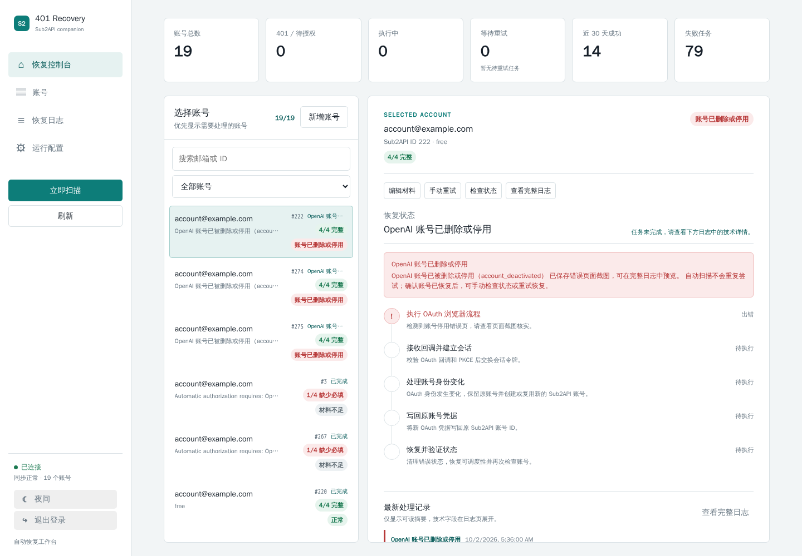
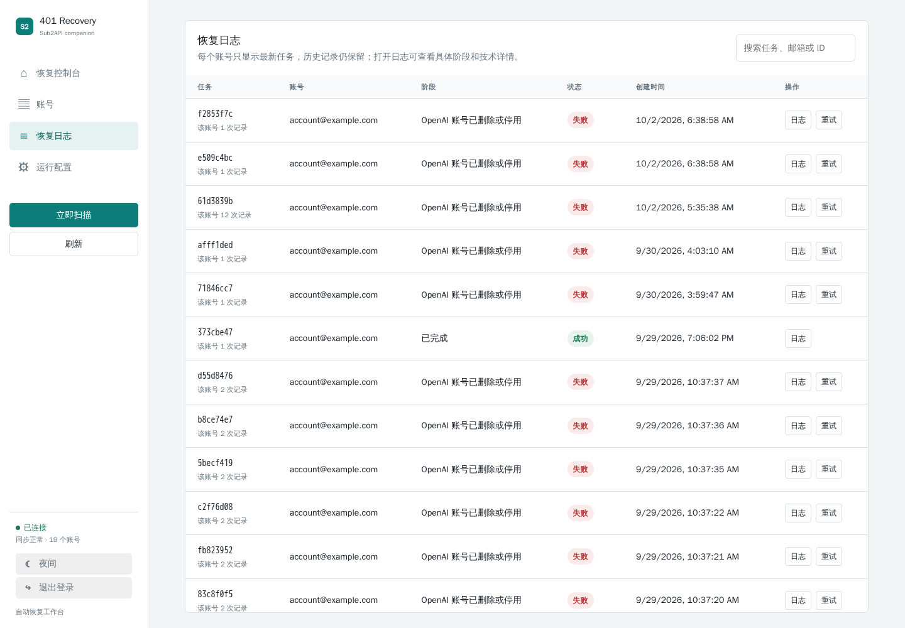

# Sub2API 401 Recovery

English: [README.md](README.md)

Sub2API 401 Recovery 是 Sub2API 的配套恢复服务。它通过 Sub2API Admin API 同步账号状态，识别 OAuth 凭据失效，并在账号备注中存在必要登录材料时，自动执行重新授权、验证码处理、TOTP 验证和凭据回写。

它面向自行维护 Sub2API 的运营者，目标是把“发现 401、定位失败阶段、恢复账号、保留证据”变成一个可观察的工作流，而不是逐个账号手工处理。

## 项目特点

- 每 60 秒被动同步 Sub2API 的账号列表、详情、错误信息和状态变化。
- 识别 HTTP 401、`token_revoked`、`invalid_token`、`invalid_grant` 等凭据失效信号。
- 可选启用低频主动探测：从每个账号当前的 `/models` 目录动态选择文本模型，不把模型名称写死。
- 主动探测默认每 30 分钟最多检查 1 个账号，并对单账号设置冷却时间，避免每 60 秒都发起真实模型请求。
- 自动执行 Chromium OAuth 流程，处理邮箱验证码和 TOTP 验证。
- 完成 PKCE 授权码交换，把新凭据回写到原 Sub2API 账号并再次校验。
- Dashboard 展示账号、任务、阶段、重试时间和技术错误详情。
- 遇到账号被停用或删除页面时保存加密截图，便于人工复核。
- 提供受保护的手动删除入口，只有在确认账号确实停用后才建议执行。

服务不会修改 Sub2API 源码，也不会默默创建替代账号。OAuth 身份发生变化时，会在恢复记录中明确显示，并按照配置的策略处理。

## 工作流程

```text
Sub2API 账号状态
        │
        ├─ 被动同步：读取账号错误和 401 状态
        │
        └─ 可选主动探测：动态发现模型，低频发送测试请求
                         │
                         ▼
                创建恢复任务和证据记录
                         │
                         ▼
       读取备注材料 → 打开 OAuth → 邮箱验证码 → TOTP
                         │
                         ▼
                 PKCE 换取新凭据并回写
                         │
                         ▼
                    恢复后再次验证
```

## 界面预览





## 运行要求

| 项目 | 建议配置 |
| --- | --- |
| CPU | 2 核或以上 |
| 内存 | 4 GB 起步，账号较多时建议 8 GB |
| 磁盘 | 至少 10 GB 可用空间；截图和日志较多时单独挂载持久化磁盘 |
| 系统 | Linux x86_64，Docker Engine 和 Compose v2 |
| 网络 | 能访问 Sub2API、OpenAI 登录页面以及邮箱 IMAP 服务 |

主动浏览器流程会消耗额外内存。大量账号同时恢复时，应通过并发配置控制浏览器数量，不建议在资源很小的机器上无限提高并发。

## 快速开始

### 使用发布版

当前发布版为 `v0.4.0`：

```bash
git clone https://github.com/AnnaKarelovsky/sub2api-401-recovery.git
cd sub2api-401-recovery
cp .env.example .env
```

编辑 `.env`，至少填写：

```dotenv
SUB2API_BASE_URL=https://your-sub2api.example.com
SUB2API_ADMIN_KEY=your-admin-key
```

然后启动：

```bash
docker compose -f docker-compose.release.yml up -d
docker compose -f docker-compose.release.yml logs -f recovery-worker
```

发布版安装脚本也会创建 `data`、`backups` 和 `evidence` 目录：

```bash
VERSION=v0.4.0 bash install-release.sh
```

### 从源码运行

```bash
cp .env.example .env
docker compose up -d --build
```

API 默认监听 `127.0.0.1:1455`。如果通过反向代理或局域网访问，请自行配置访问控制和 TLS，不要直接把管理面板暴露到公网。

## 必要配置

### Sub2API

```dotenv
SUB2API_BASE_URL=https://your-sub2api.example.com
SUB2API_ADMIN_KEY=your-admin-key
SUB2API_TIMEOUT_SECONDS=30
```

### 自动恢复

```dotenv
RECOVERY_ENABLED=true
SCAN_INTERVAL_SECONDS=60
MAX_CONCURRENT_RECOVERIES=1
```

### 主动 401 探测

被动同步是主要检测方式；主动探测会向 Sub2API 发起真实的短模型请求，因此默认关闭或低频运行：

```dotenv
UPSTREAM_PROBE_ENABLED=true
UPSTREAM_PROBE_INTERVAL_SECONDS=1800
UPSTREAM_PROBE_MAX_PER_SCAN=1
```

主动探测不应设置为每 60 秒扫描全部账号。它只作为被动错误信息不完整时的补充，并且仍可能受到上游限流、账号策略或网络出口影响。

### 代理和证据目录

如果服务器访问 OpenAI 或邮箱服务需要代理：

```dotenv
HTTP_PROXY=http://127.0.0.1:7890
HTTPS_PROXY=http://127.0.0.1:7890
ALL_PROXY=http://127.0.0.1:7890
```

截图、日志和恢复证据通过 `EVIDENCE_DIR` 保存。生产环境建议把它映射到独立持久化磁盘：

```dotenv
EVIDENCE_DIR=/evidence
EVIDENCE_HOST_DIR=/path/to/persistent/evidence
EVIDENCE_MOUNT_REQUIRED=true
```

证据目录包含账号登录相关的敏感信息，应限制文件权限，不要提交到 Git，也不要放在可公开访问的静态目录下。

## 备注材料格式

自动恢复只会使用账号备注中明确存在的材料。支持中文标签、英文标签和 JSON 格式，例如：

```text
邮箱：user@example.com
邮箱密码：mail-password
OpenAI密码：openai-password
2FA密钥：BASE32SECRET
```

或：

```json
{
  "email": "user@example.com",
  "email_password": "mail-password",
  "openai_password": "openai-password",
  "totp_secret": "BASE32SECRET"
}
```

四项不一定必须全部存在。系统会根据实际登录页面和可用材料选择路径，并在 Dashboard 中显示材料完整度以及缺少的项目。常见情况包括：

- 只需要邮箱和邮箱验证码的账号，不需要 OpenAI 密码或 TOTP。
- 需要 OpenAI 密码的账号，备注必须包含可用的 OpenAI 密码。
- 出现 TOTP 页面时，必须有有效的 TOTP 密钥。
- 邮箱验证码无法读取、凭据过期、触发额外安全挑战或页面结构变化时，任务会失败并记录具体阶段。

备注中不应放无关文本，也不要把真实密码写入 README、截图或工单。建议在 Sub2API 管理端完成备注编辑，并在恢复控制台确认材料状态。

## 恢复边界

服务可以自动处理标准 OAuth 登录、邮箱验证码、TOTP、PKCE 回调和凭据回写，但不能绕过：

- CAPTCHA 或需要人工确认的安全挑战。
- 邮箱服务不可用、验证码读取失败或验证码已经过期。
- OpenAI 账号已被停用、删除或处于需要人工申诉的状态。
- 代理出口被上游拒绝、网络不稳定或浏览器无法加载登录页面。
- 备注材料错误、缺失或与实际账号不匹配。

这些情况会显示为明确的失败阶段，并在账号详情中保留技术日志和可用截图。系统不会因为一次失败就删除 Sub2API 账号。

## 证据和删除策略

账号停用或删除页面会保存截图和错误码，方便区分“账号确实被停用”和“网络、验证码、代理或页面流程失败”。恢复日志默认保留，删除账号前应先人工确认证据。

项目提供单独的批量删除入口，但删除属于不可逆操作。建议只选择已确认停用、已完成证据复核且不再需要历史记录的账号，并在删除前导出必要日志。

## 日常运维

```bash
docker compose ps
docker compose logs --tail=100 recovery-api recovery-worker
docker compose restart recovery-worker
docker compose pull
docker compose up -d
```

Dashboard 主要页面：

- 恢复控制台：查看账号队列、当前阶段和手动启动恢复。
- 账号：查看同步到的 Sub2API 账号、材料完整度和账号状态。
- 恢复日志：按任务查看完整过程、错误码和证据截图。
- 运行配置：查看和修改运行参数，敏感值只显示配置状态。

## 开发与测试

```bash
python3 -m venv .venv
source .venv/bin/activate
pip install -r requirements.txt
pytest -q
ruff check .
```

不要在测试或日志中使用真实账号密码、邮箱密码、TOTP 密钥、Admin Key 或 OAuth token。提交前请检查 Git 状态，确认敏感文件和本地证据目录没有被加入版本库。

## 目录结构

```text
app/                    API、worker、数据库和前端资源
docs/screenshots/       README 使用的脱敏界面截图
docker-compose.yml      源码运行配置
docker-compose.release.yml 发布版运行配置
install-release.sh      发布版安装脚本
.env.example            配置模板
```

## 责任说明

本项目只适用于你有权管理的 Sub2API 实例和账号。请遵守 OpenAI、邮箱服务商、代理服务商及所在地区的条款。自动化登录涉及敏感凭据，部署前应配置访问控制、备份和最小权限。

